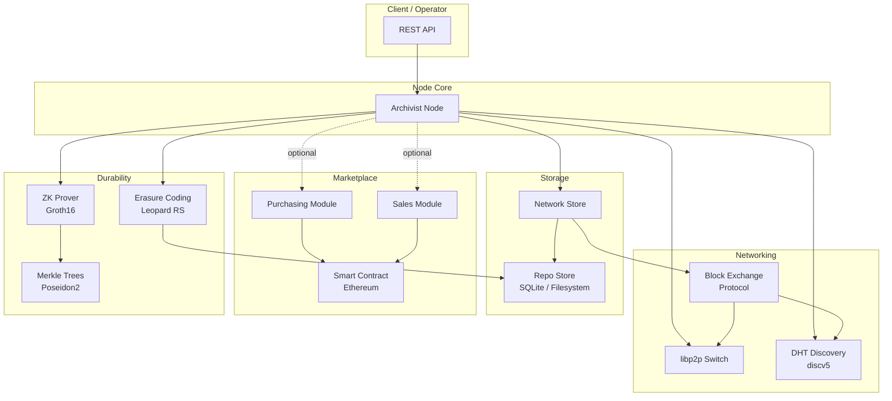
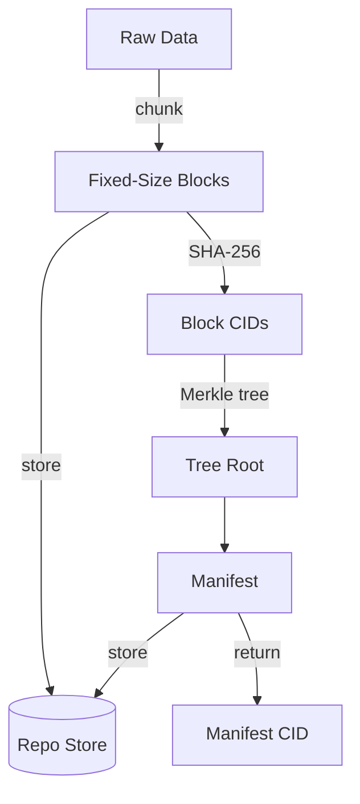
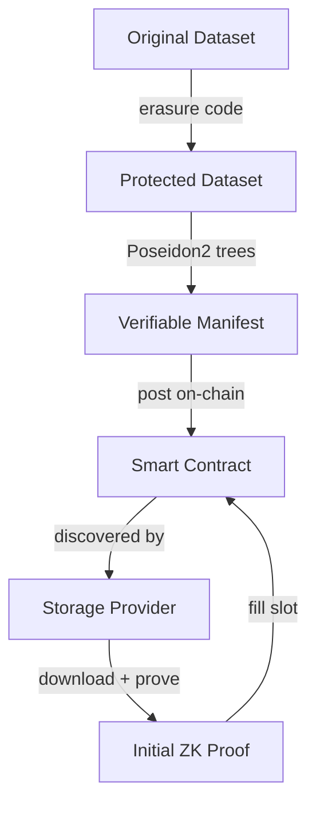
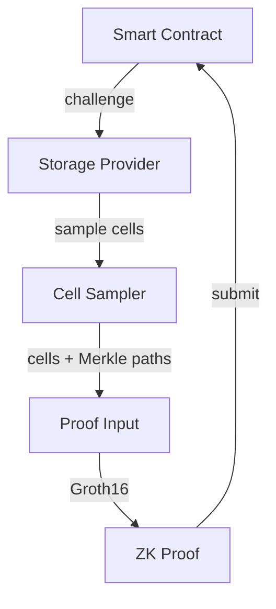
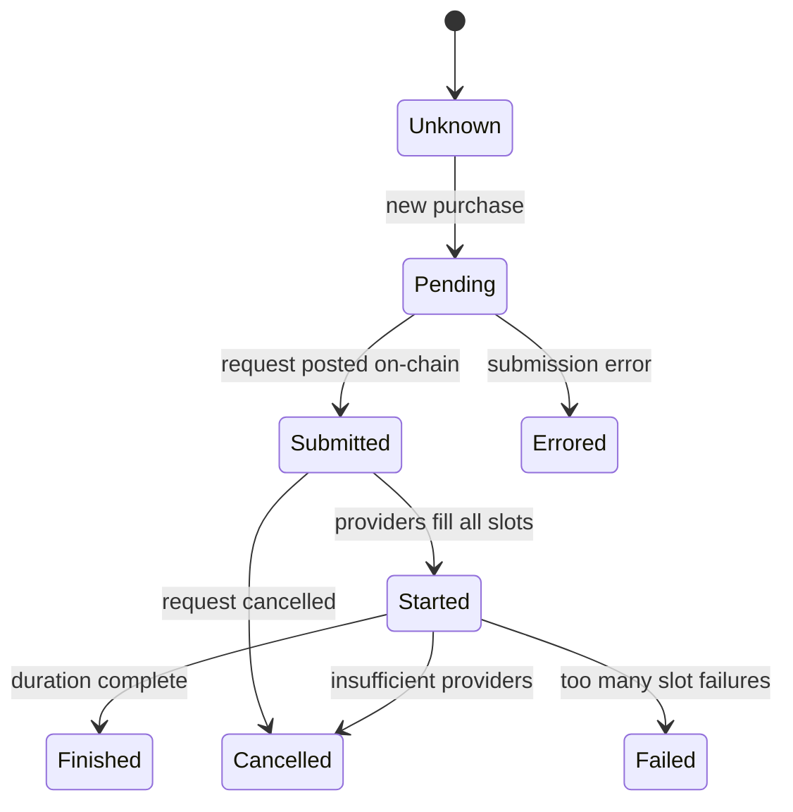
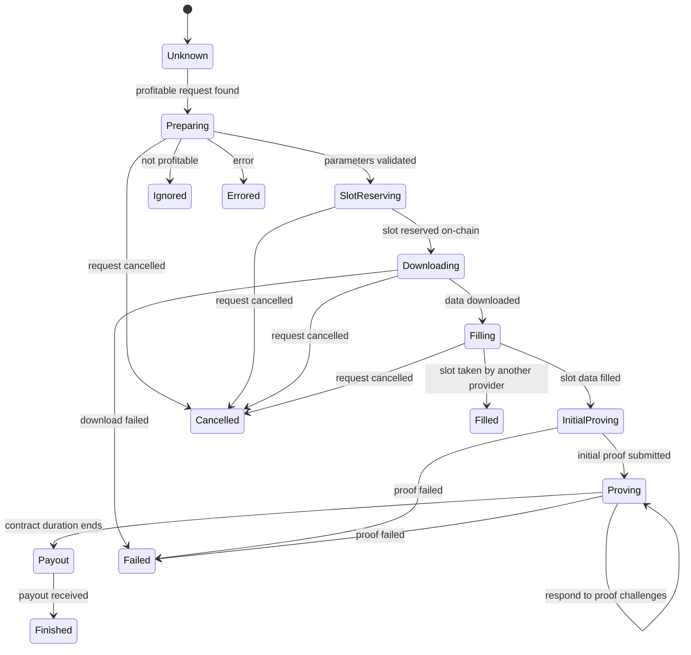

# Architecture

Archivist is a decentralized durability engine. Data is encrypted locally, erasure-coded, dispersed across independent operators, verified by zero-knowledge proofs, and repaired automatically. No single point of failure.

The system can achieve nine to eleven nines of durability while remaining storage and bandwidth efficient. Because data is encrypted before leaving the client, hosts have plausible deniability over what they store; clients get cryptographic proof that their data still exists.

## Decentralized Durability Engine

Archivist is formally modeled as a Decentralized Durability Engine (DDE) — a system defined by the tuple Γ = (R, A, P, I, D), where each component addresses a distinct failure mode of decentralized storage. If any one is missing, the durability guarantee breaks down. The [whitepaper](/learn/whitepaper) provides the full formal treatment.

## R.A.P.I.D. Framework

The five components of the DDE:

| Component | What it does |
|-----------|-------------|
| **Redundancy** | Erasure coding splits data across multiple slots so any subset can reconstruct the original |
| **Auditing** | Zero-knowledge proofs of retrievability verify data possession without downloading it |
| **Repair** | Detect and correct corruption and loss automatically using erasure-coded redundancy |
| **Incentives** | Economic mechanisms (collateral, slashing, rewards) align participant behavior |
| **Dispersal** | Data is spread across independent operators so no single failure takes it down |

## System Overview

The Archivist network consists of clients, storage providers, and validators interacting through a peer-to-peer layer and an on-chain smart contract.

### Node Architecture

An Archivist node is a single binary that combines peer-to-peer networking, local storage, a block exchange protocol, an optional on-chain marketplace, and a cryptographic proof system.

### Node Roles

Every Archivist node runs the same software. The role a node plays depends on its configuration:

**Storage providers** commit storage capacity to the network. They stake collateral against storage contracts, download client data, and post periodic zero-knowledge proofs of data possession to the on-chain smart contract. Failure to prove results in slashing.

**Clients** upload data, create storage requests, and retrieve data from the network. Any node can act as a client through the REST API.

**Validators** monitor the smart contract and mark missed proofs, triggering the slashing and repair mechanisms.

## Data Lifecycle

### Upload

When a client uploads data through the REST API:

1. The data stream is chunked into fixed-size blocks (default 512 KiB)
2. Each block is hashed (SHA-256) to produce a content identifier (CID)
3. Blocks are stored locally in the repo store
4. A Merkle tree is built over all block CIDs
5. A **manifest** is created—a metadata record containing the tree root CID, block size, dataset size, and encoding parameters
6. The manifest CID is returned to the client

### Storage Request

When a client wants durable, provable storage across the network:

1. The dataset is **erasure coded** — original blocks are expanded with parity blocks so any `k` of `n` slots can reconstruct the data
2. A **verifiable manifest** is created — slot-level Merkle trees using Poseidon2 hashing, producing ZK-friendly commitment roots
3. A **storage request** is posted to the Ethereum smart contract with parameters: CID, duration, number of slots, proof probability, price, and collateral requirements
4. Storage providers discover the request, download the slot data, generate an initial proof, and fill the slot on-chain
5. Throughout the contract duration, providers must respond to random proof challenges

### Retrieval

Data retrieval is straightforward:

1. A client requests data by manifest CID
2. If blocks are available locally, they are served directly
3. If not, the block exchange protocol fetches them from peers who have them
4. For erasure-coded datasets, missing blocks can be reconstructed from available parity data

The block exchange protocol maintains want-lists and block presence information across connected peers, allowing efficient discovery and transfer of needed blocks.

### Repair

When a storage provider fails — goes offline, loses data, or stops proving — the system self-heals:

1. The smart contract detects missed proofs and marks the slot as failed
2. The failed provider's collateral is partially slashed; a portion funds the repair
3. The slot becomes available for a new provider
4. The new provider reconstructs the slot data from the remaining slots using erasure coding
5. The new provider generates a valid proof and fills the slot

This is the "lazy repair" mechanism: repair happens on demand when failure is detected, rather than through continuous background replication. Erasure coding makes this possible because any sufficient subset of slots contains enough information to reconstruct any individual slot.

## Erasure Coding

Archivist uses Leopard Reed-Solomon coding. A dataset with `k` original blocks is expanded to `n = k + m` blocks, where any `k` blocks are sufficient to reconstruct the original data.

In the context of storage contracts:
- A storage request specifies `nodes` (total slots) and `tolerance` (how many can be lost)
- `k = nodes - tolerance` original slots, `m = tolerance` parity slots
- As long as at most `tolerance` providers fail, the data survives

Erasure coding runs on a thread pool to avoid blocking the async event loop, since the computation is CPU-intensive.

## Proof System

Archivist uses zero-knowledge proofs to verify that storage providers still possess the data they committed to store, without requiring them to transmit it.

### How proofs work

1. The smart contract issues a **challenge** to a storage provider at stochastically determined intervals — the provider cannot predict when the next challenge will come
2. The provider's **sampler** selects specific cells from their stored slot data based on the challenge
3. The selected cells, along with their Merkle tree proofs, form the **proof input**
4. A **Groth16 ZK proof** is generated, proving that the provider possesses the correct data at the challenged positions
5. The proof is submitted to the smart contract for on-chain verification

### Merkle tree structure

Archivist uses a two-level Merkle tree structure:

- **Block-level tree**: A SHA-256 Merkle tree over the block CIDs of the entire dataset. This produces the dataset's tree root CID used in manifests.
- **Slot-level tree**: A Poseidon2 Merkle tree over the cells within a slot. Poseidon2 is a ZK-friendly hash function over the BN128 elliptic curve, which makes proof generation efficient. Each slot has its own root, and all slot roots combine into a verification root committed on-chain.

## Marketplace

The marketplace is an Ethereum smart contract that facilitates matching between storage clients and providers. It is optional — nodes can run without Ethereum connectivity for local storage and peer-to-peer block exchange.

### Smart contract

The smart contract manages storage request lifecycle, slot allocation, proof verification, and collateral/payment flows. The main parameters of a storage request are:

- **CID**: content identifier of the data to be stored
- **Duration**: how long the data should be stored
- **Slots**: number of storage providers (derived from erasure coding parameters)
- **Proof probability**: how frequently proofs are required
- **Price per byte per second**: what the client pays
- **Collateral per byte**: what each provider must stake

Proof timing is stochastic — the contract determines when a provider must prove, ensuring providers cannot game the system by only keeping data around proof times.

### Purchasing module

The purchasing module manages storage requests on behalf of the client. It tracks each request through a state machine:

### Sales module

The sales module manages slot-filling on behalf of the storage provider. It monitors the contract for incoming requests, evaluates profitability, and manages the slot lifecycle:

The sales module favors requests with high rewards and low collateral, though more specialized strategies can be implemented.

## Networking

### libp2p

Archivist nodes communicate over libp2p using:
- **Noise** protocol for encrypted connections
- **Mplex** for stream multiplexing
- **TCP** transport

Each node has a cryptographic identity (PeerId) derived from its private key, and advertises its listening addresses through the DHT.

### Block exchange

The block exchange protocol is a peer-to-peer system for trading blocks between nodes. Nodes maintain:
- **Want lists**: blocks they need from peers
- **Block presence**: which blocks they have available
- **Payment channels** (planned): for compensating peers who provide blocks

When a node needs a block, it broadcasts the want to connected peers. Peers with the block respond with delivery. The protocol includes discovery integration — if no connected peer has a needed block, the DHT is queried to find providers.

### DHT discovery

Content and peer discovery uses the discv5 protocol (the same DHT protocol used by Ethereum's consensus layer). Nodes advertise which content they store, and other nodes can query the DHT to find providers for specific CIDs.

## REST API

All node operations are exposed through an HTTP REST API under `/api/archivist/v1/`. Key endpoint groups:

| Group | Endpoints | Purpose |
|-------|-----------|---------|
| **Data** | `POST /data`, `GET /data/{cid}`, `DELETE /data/{cid}` | Upload, download, delete datasets |
| **Network** | `POST /data/{cid}/network`, `GET /data/{cid}/network/stream` | Fetch data from peers |
| **Sales** | `GET /sales/slots`, `GET/POST /sales/availability` | Manage provider slots and terms |
| **Purchasing** | `POST /storage/request/{cid}`, `GET /storage/purchases` | Create and track storage requests |
| **Node** | `GET /spr`, `GET /peerid`, `GET /connect/{peerId}` | Node identity and connectivity |
| **Debug** | `GET /debug/info`, `POST /debug/chronicles/loglevel` | Diagnostics and log control |

See the full [API reference](/developers/api) for details.

## Further Reading

- [Whitepaper](/learn/whitepaper) — formal treatment of the Decentralized Durability Engine, reliability modeling, and proof system
- [Tokenomics Litepaper](/learn/tokenomics-litepaper) — token mechanics and incentive design
- [API Reference](/developers/api) — complete REST API documentation
