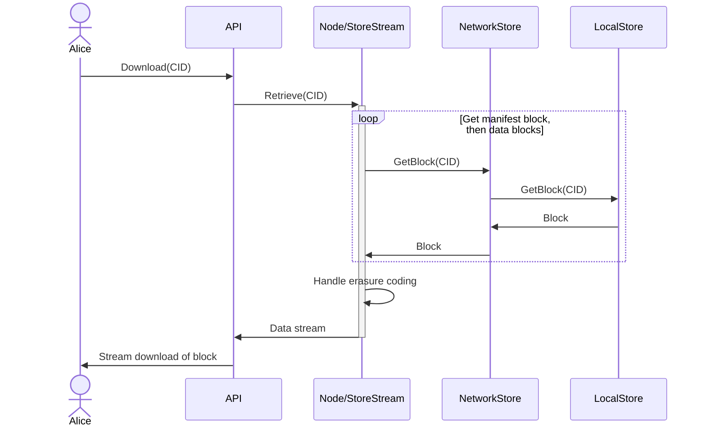
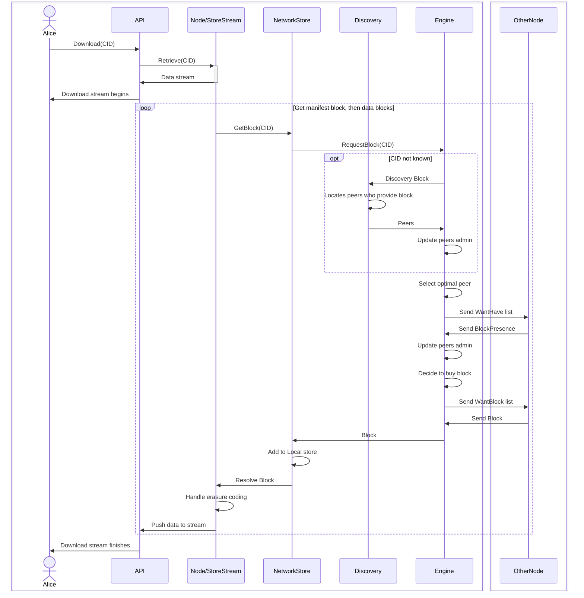

# Процесс загрузки
Последовательность взаимодействий, приводящих к передаче блоков данных через сеть.

## Локальное хранилище
Когда данные доступны в локальном хранилище блоков,

## Сетевое хранилище
Когда данные не найдены в локальном хранилище блоков, используется механизм обмена блоками для обнаружения местоположения блока в сети. Устанавливается соединение с узлом(ами), у которых есть блок, и происходит обмен.

